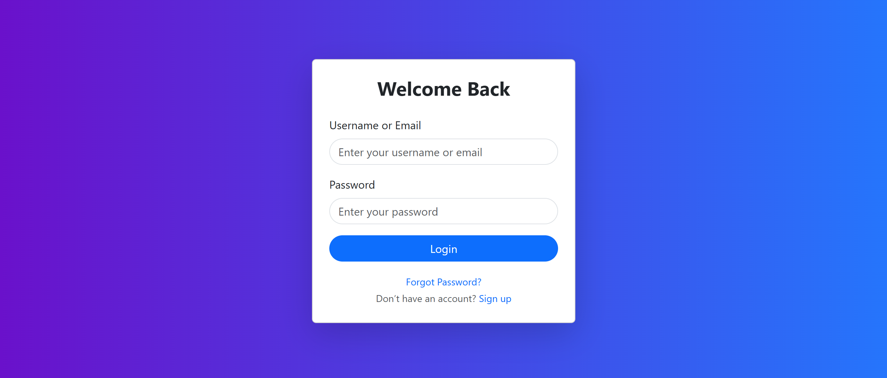
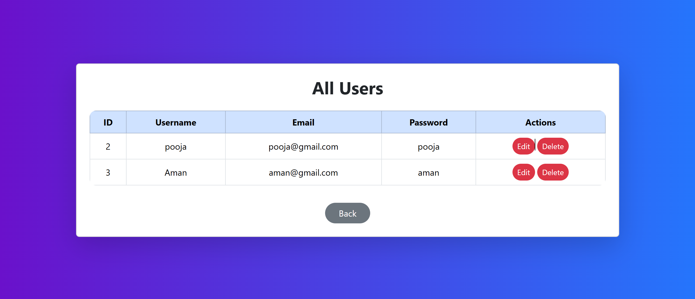

🚀 User Management System

A full-stack Node.js + Express + MySQL application with user authentication and CRUD functionality.
Built using EJS for templating and Bootstrap 5 for a clean UI.

✨ Features

      ✅ User Login with Email or Username
      ✅ Sign-up for new users
      ✅ View all users (with password for admin view)
      ✅ Edit & Delete user records
      ✅ Bootstrap 5 responsive UI
      ✅ MySQL database integration
      ✅ Uses method-override for PATCH/DELETE in forms

📸 Screenshots

Login Page -

All Users Page -

🛠 Tech Stack

    Backend: Node.js, Express.js

    Database: MySQL

    Templating: EJS

    Styling: Bootstrap 5

⚙️ Installation & Setup

    1️⃣ Clone the repository
    git clone <your-repo-url>
    cd <project-folder>

    2️⃣ Install dependencies
    npm install

    3️⃣ Configure Environment Variables

    Create a .env file in the root folder:

    PORT=8080
    DB_HOST=localhost
    DB_USER=root
    DB_PASSWORD=root
    DB_NAME=backend

    4️⃣ Setup MySQL Database

    Run these commands:

    CREATE DATABASE backend;
    USE backend;

    CREATE TABLE users (
        id INT AUTO_INCREMENT PRIMARY KEY,
        username VARCHAR(255) NOT NULL,
        email VARCHAR(255) UNIQUE NOT NULL,
        password VARCHAR(255) NOT NULL
    );

    5️⃣ Start the Server
    node index.js

The app will run at: http://localhost:8080

🔑 API Endpoints

        Method	  Endpoint	        Description
        GET	      /Login            Page
        POST      /user	            Authenticate User
        GET	      /newuser	        Sign-up Page
        POST      /user/signup	    Create New User
        GET	      /allusers	List    All Users
        GET	      /user/:id	Edit    User Page
        PATCH	  /user/:id	        Update User
        DELETE	  /user/:id	        Delete User

👨‍💻 Author

Developed by Aman.
⭐ Star this repo if you find it helpful!
